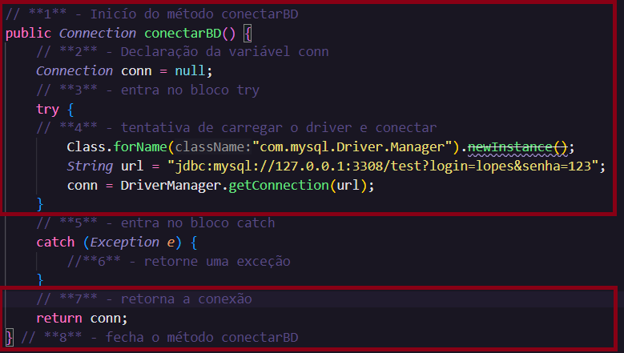
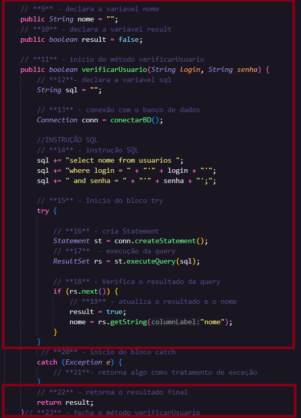
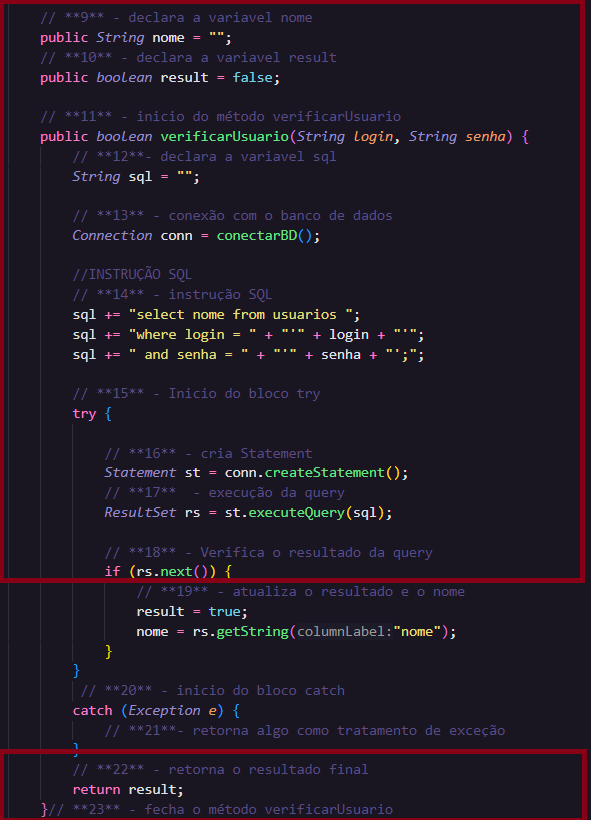
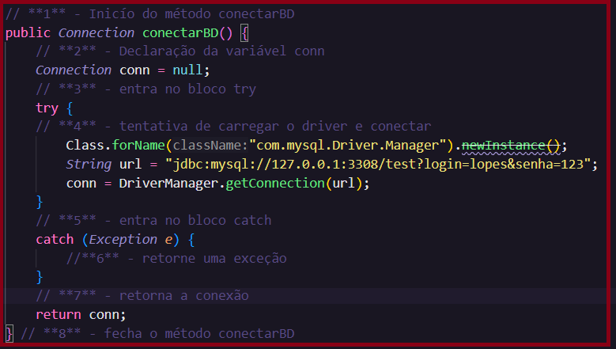
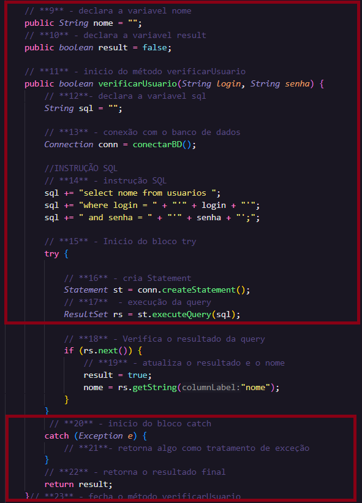
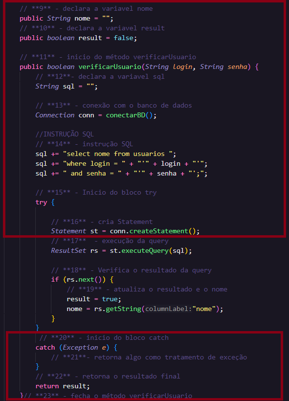

<h2 align="center"> Teste de Caixa Branca </h2>

<h3 align="center"> Grafo de Fluxo</h3>

<h3>Complexidade Ciclomática</h3>

<h4><i>Identificação dos Nós e Arestas:</i></h4>

Total de Arestas E = 23;
Total de Nós N = 21;
Componentes Conectados P = 1.

<h4><i>Cálculo:</i></h4>

<pre>M = E - N + 2.P 
M = 23 - 21 + 2.1 = 4</pre>

<h4><i>Resultado da Complexida Ciclomática:</i></h4>

<pre>A complexidade M desse código é 4.</pre>

<h3>Sequência dos caminhos</h3>

<li>Caminho 1 (Caminho Verdadeiro):</li>

Método <i>conectarBD</i> - Executa o bloco try com sucesso -> Retorna a conexão. 
Método <i>verificarUsuário</i> - Executa o bloco try com sucesso -> Entra na condição if (rs.next()), login e senha estão corretas -> Retorna true -> Retorna o resultado final antes de fechar o método

<li>Caminho 2 (Caminho Falso):</li>

Método <i>conectarBD</i> - Executa o bloco try com sucesso -> Retorna a conexão. 
Método <i>verificarUsuário</i> - Executa o bloco try com sucesso -> Entra na condição if (rs.next()), resultado da query como false, login e senha estão incorretos -> Retorna false -> Retorna o resultado final antes de fechar o método

<li>Caminho 3 (Caminho Falso):</li>

Método <i>conectarBD</i> - Executa o bloco try sem sucesso -> Ocorre uma exceção e executa o bloco catch, como não há uma ação específica, o fluxo vai para o final do bloco -> Retorna a conexão nula ou inválida. 
Método <i>verificarUsuário</i> - Executa o bloco try sem sucesso, ocorrendo uma exceção no número 17 do código, ao executar a query, após a conexão com o BD estar inválida -> Entra no bloco catch, como não há uma ação específica, o fluxo vai para o final do bloco -> Retorna o resultado final

<li>Caminho 4 (Caminho Falso):</li>

Método <i>conectarBD</i> - Executa o bloco try com sucesso -> Retorna a conexão. 
Método <i>verificarUsuário</i> - Executa o bloco try sem sucesso, ocorrendo uma exceção no número 16 do código, ao criar o Statement. -> Entra no bloco catch, como não há uma ação específica, o fluxo vai para o final do bloco -> Retorna o resultado final 

<h3><i>Resumo dos caminhos:</i></h3>

<li>Caminho (1): 1 - 2 - 3 - 4 - 7 - 8 - 9 - 10 - 11 - 12 - 13 - 14 - 15 - 16 - 17 - 18 - 19 - 22 - 23</li> 

<li>Caminho (2): 1 - 2 - 3 - 4 - 7 - 8 - 9 - 10- 11- 12 - 13- 14 - 15 - 16 - 17 - 18 - 22 - 23</li> 

<li>Caminho (3): 1 - 2 - 3 - 4 - 5 - 6 - 7 - 8 - 9 - 10 - 11 - 12 - 13 - 14 - 15 - 16 - 17 - 20 - 21 - 22 - 23</li> 

<li>Caminho (4): 1 - 2 - 3 - 4 - 7 - 8 - 9 - 10 - 11 - 12 - 13 - 14 - 15 - 16 - 20 - 21 - 22 - 23</li> 

