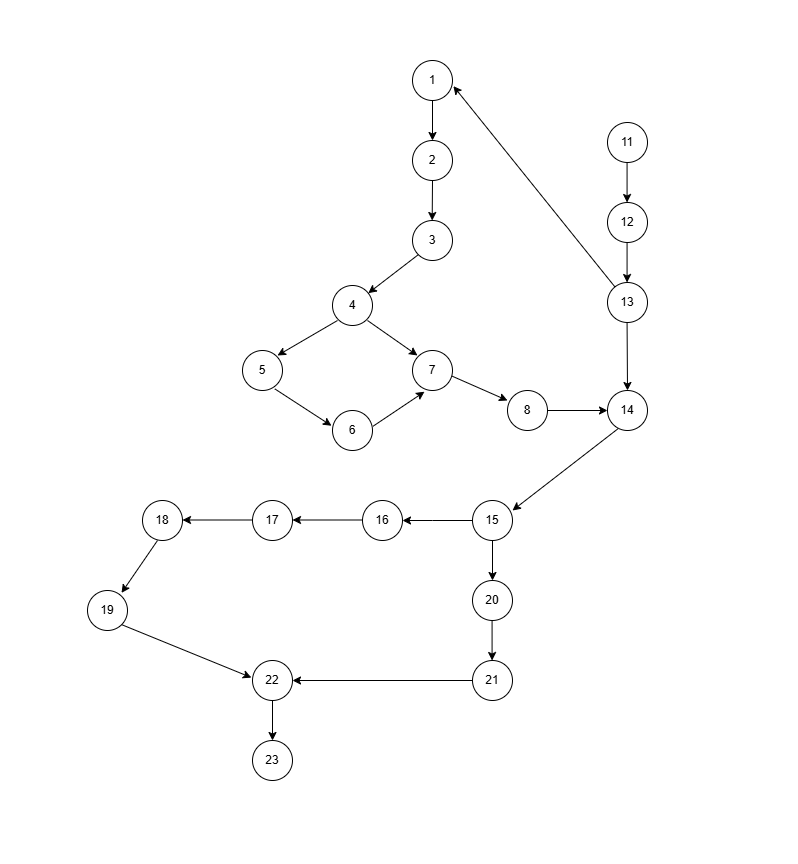

<h2 align="center"> Teste de Caixa Branca </h2>

<h3 align="center"> Grafo de Fluxo</h3>

<h3>Complexidade Ciclomática</h3>

Identificação dos Nós e Arestas

Total de Arestas E = 23;
Total de Nós N = 21;
Componentes Conectados P = 1.

Cálculo

M = E - N + 2.P
M = 23 - 21 + 2.1 = 4

Resultado da Complexida Ciclomática

A complexidade M desse código é 4.

<h3>Caminhos Básicos</h3>

<li>Caminho 1:</li>
<li>Caminho 2:</li>
<li>Caminho 3:</li>
<li>Caminho 4:</li>

Resumo dos caminhos:

<li>Caminho 1: 1; 2; 3; 4; 7; 8; 9; 10; 11; 12; 13; 14; 15; 16; 17; 18; 19; 22; 23</li>
<li>Caminho 2: 1 -> 2 -> 3 -> 4 -> 5 ->7-> 8 -> 9 -> 10-> 11-> 12 -> 13-> 14 -> 15-> 16 -> 17 ->18 -> 22 -> 23</li>
<li>Caminho 3: 1;2;3;4;5;6;7;8;9;10;11;12;13;14;15;16;17;20;21;22;23</li>
<li>Caminho 4: 1;2;3;4;7;8;9;10;11;12;13;14;15;16;20;21;22;23</li>
